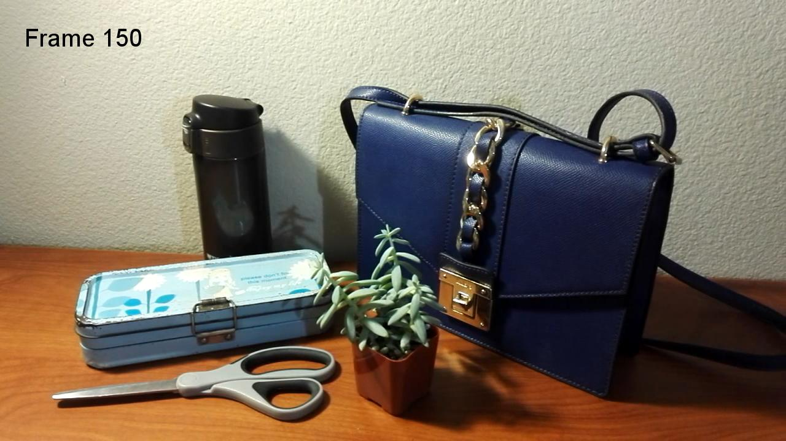
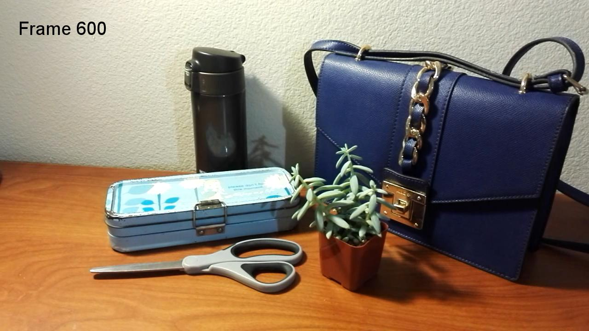
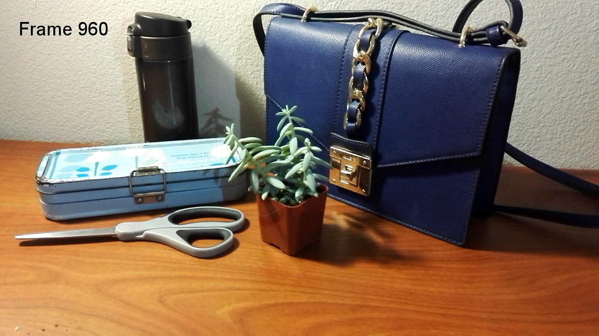
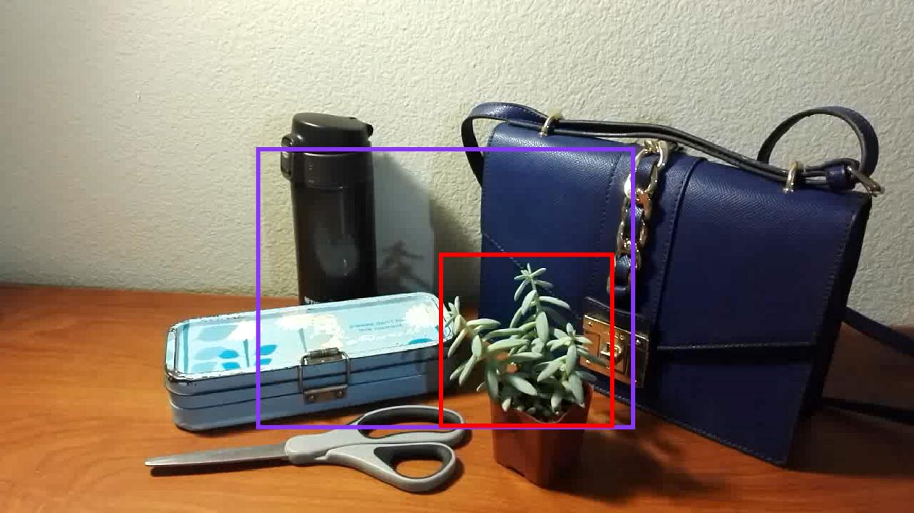
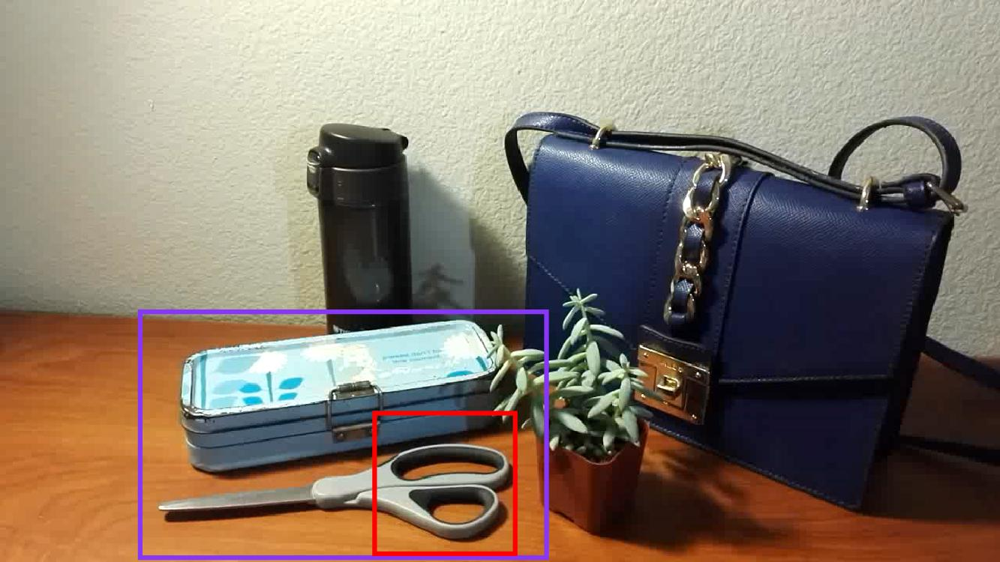
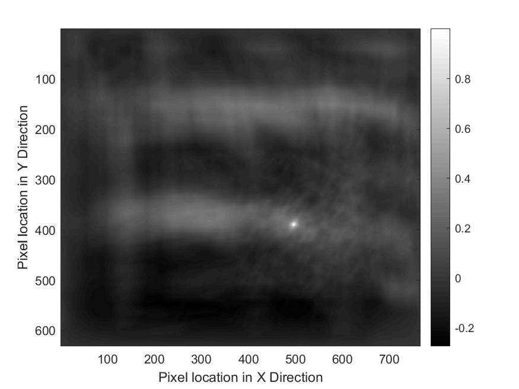
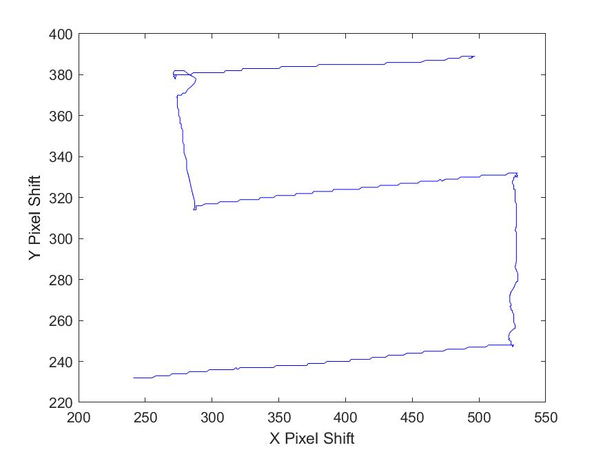

# Project 2: Image Refocusing with 4D Light Field

Main code: [Imaging.m](Imaging.m)

Full report: [report.pdf](HW2_report.pdf)

 

## Objectives

To synthesize images with smaller depths of field thus making it appear to have been taken from an expensive camera with a larger aperture by blurring out the background of an all-in focus image.

## Instructions

1. Set up a static scene in which objects are placed at different depth.

    

2. Capture a 4D light field by taking a video while waving the camera in front of the scene by following a specific planar motion. Three example frames as such:

      

3. Write a function to read the video file and convert into a sequence of gray-scale frames. The gray-scale image of the first frame of the video is displayed as bellow:

    

4. Select an object as a template and register all other frames of the video with respect to this template. Two example templates and windows are:

     

5. Perform a normalized cross correlation of the template with the extracted search window. The plot of the correlation coefficient matrix is:

    

6. Retrieve the pixel shifting trajectory by searching the point position that yields the maximum value of the coefficient that is used to compute the shift. Thus, the trajectory of the camera movement is retrieved:

    

7. Synthesize a refocused image with synthetic aperture by shifting each frame in the opposite direction and then summing up all the frames. Two examples of refocused images are displayed as bellow:

     

 

Full report see: [report.pdf](HW2_report.pdf)
