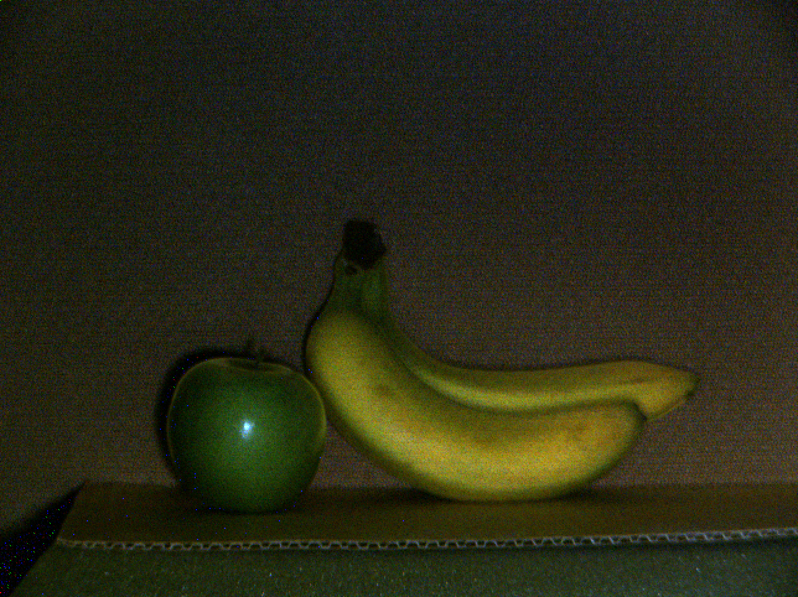

# Project 3: Image-based Relighting using Light Transport Matrix

Main code: [Imaging.m](Imaging.m)

Full report: [report.pdf](HW3_report.pdf)

 

## Motivation

The light of *light transport* probes how light travels from a light source to a camera. In the first part of the project, we gain command of multipath interference by decomposing a scene image into two components based on **direct illumination** and **global illumination**. In the second part of the project, we leverage our understanding of the light transport matrix to synthesize photo-realistic images in novel lighting conditions.

## Instructions

1. Separate direct illumination component and global illumination component

    (From left to right: raw scene image, direct illumination component, global illumination component)

      

    Scene 1 (glass, liquid, marble, rocks, wall): Global component shows different physical phenomenon such as subsurface scattering, volumetric scattering, reflection, etc.

      

    Scene 2 (eggs, paper box): Global component shows strong diffuse interreflection, reflection on porous structure.

      

    Scene 3 (peppers): Global component shows subsurface scattering. Direct component shows specular reflection, diffuse reflection.

      

    Scene 4 (green apple, banana, cardboard): Global component shows subsurface scattering. 

2. Image-based relighting

    Captured images with single light source:

     

    Synthetic image with both lights on:

    

    Synthetic image with novel lighting:

    

 

Mathematical assessment and equation derivation see full report: [report.pdf](HW3_report.pdf)
